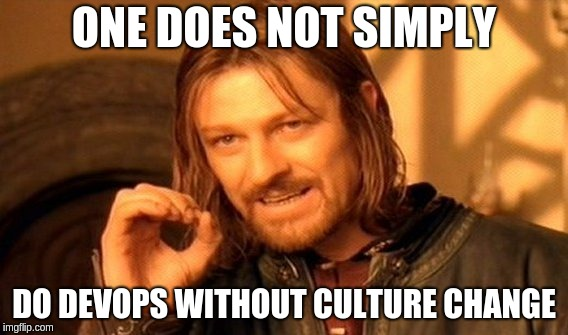

# onboarding
DevOps Onboarding

¡Bienvenido! Seguramente estás aquí porque te has preguntado cómo iniciarte en el mund DevOps y alguien majete te compartió este enlace.

Si vienes del mundo de sistemas/ops:

Empieza tus primeros pinos por la parte de automatización, en nuestra humilde opinión es la primera puerta que abren los que venimos de sistemas pues estamos acostumbrados de antaño a automatizar tareas y procesos con Bash, Perl, Python, etc. Las herramientas actuales de gestión de la configuración no sólamente llevan esta labor a un nuevo nivel sino que hacen que empieces a pensar de forma diferente cómo manejas tu infraestructura.

Mantras:
* No crear o configurar recursos en una interfaz web a único que sea la **única** vía posible
* No tocar archivos de configuración del sistema o la aplicación de forma manual
* No acceder por SSH a tus servidores más que para depurar algo _raruno_
* KISS (Keep It Simple, Stupid)
* DRY (Don't Repeat Yourself)

Si vienes del mundo del desarrollo: ???

### Roadmap

Es muy probable que hayas visto el siguiete diagrama. En caso contrario, es un resumen muy acertado del camino a seguir para adentrarte en el mundo de DevOps. Los colores en amarillo son las tecnologías líderes mientras que las beige, las otras disponibles. Se recomienda dominar de primera mano las amarillas.

